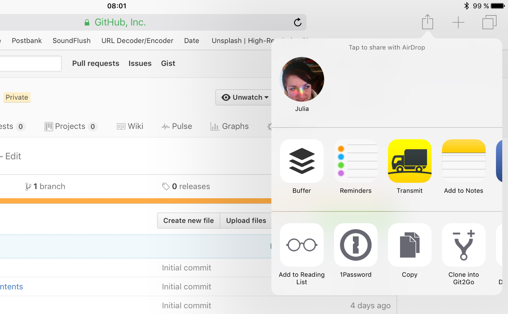

# Designing Pro Apps Playgroundbook

This is a companion playground book, which I developed for my talk at [FrenchKit](http://frenchkit.fr). It demonstrates how to use and implement `UIKeyCommands` and `UISplitViewController`.

To try this book out you can simply clone it using [Git2Go](https://appsto.re/de/5yWB5.i), visit this site in Safari on your iPad and tap `Clone into Git2Go` from the Safari Share menu.

